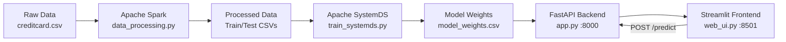

# 💳 Credit Card Fraud Detection

<p align="center">
  
  
  
  
  
  
</p>

<p align="center">
  Hệ thống phát hiện gian lận giao dịch thẻ tín dụng tích hợp<br>
  <b>Apache Spark</b> (tiền xử lý) + <b>Apache SystemDS</b> (huấn luyện) + <b>FastAPI</b> (API) + <b>Streamlit</b> (Dashboard)
</p>

---

## 📋 Mục lục

- [Tổng quan](#-tổng-quan)
- [Kiến trúc hệ thống](#-kiến-trúc-hệ-thống)
- [Cấu trúc dự án](#-cấu-trúc-dự-án)
- [Yêu cầu hệ thống](#-yêu-cầu-hệ-thống)
- [Cài đặt & Chạy](#-cài-đặt--chạy)
- [Cách sử dụng](#-cách-sử-dụng)
- [API Endpoints](#-api-endpoints)
- [Docker Deployment](#-docker-deployment)
- [Kết quả](#-kết-quả)

---

## 📌 Tổng quan

**Credit Card Fraud Detection** là hệ thống end-to-end phát hiện gian lận giao dịch thẻ tín dụng sử dụng các công nghệ Big Data và Machine Learning hiện đại:

| Công nghệ | Vai trò |
|-----------|---------|
| **Apache Spark** | Tiền xử lý dữ liệu quy mô lớn, chuẩn hóa, xử lý mất cân bằng |
| **Apache SystemDS** | Huấn luyện mô hình Logistic Regression với tối ưu phân tán |
| **FastAPI** | Backend API phục vụ dự đoán, CORS, Pydantic validation |
| **Streamlit** | Dashboard trực quan với biểu đồ Plotly, form dự đoán realtime |

### Tính năng chính

- ✅ **Xử lý dữ liệu lớn** với Apache Spark (VectorAssembler, StandardScaler, undersampling)
- ✅ **Huấn luyện phân tán** với Apache SystemDS (l2svm, hyperparameters tuning)
- ✅ **API chuyên nghiệp** với FastAPI (CORS, Pydantic, lifespan, health check)
- ✅ **Dashboard đẹp** với Streamlit (Plotly charts, custom CSS, progress bar)
- ✅ **Docker hóa** toàn bộ hệ thống (docker-compose 2 services)
- ✅ **Pipeline tự động** (run_pipeline.sh)

---

## 🏗 Kiến trúc hệ thống



**Luồng dữ liệu:**

1. **Spark** đọc CSV raw → làm sạch → scale Time/Amount → undersample → train/test split
2. **SystemDS** đọc train data → huấn luyện l2svm → xuất weights + bias
3. **FastAPI** load weights → nhận request → dot product → sigmoid → trả kết quả
4. **Streamlit** hiển thị dashboard + form nhập → gọi API → hiển thị kết quả

---

## 📁 Cấu trúc dự án

```
credit-card-fraud-detection/
│
├── data/
│   ├── raw/                    # Dữ liệu gốc (creditcard.csv)
│   │   └── creditcard.csv
│   └── processed/              # Dữ liệu đã xử lý
│       ├── X_train.csv         # Feature matrix (Train)
│       ├── y_train.csv         # Labels (Train)
│       ├── X_test.csv          # Feature matrix (Test)
│       ├── y_test.csv          # Labels (Test)
│       ├── full_scaled.csv     # Full data đã scale (cho dashboard)
│       └── model_weights.csv   # Trọng số mô hình
│
├── src/
│   ├── __init__.py
│   ├── data_processing.py      # Apache Spark preprocessing
│   ├── train_systemds.py       # Apache SystemDS training
│   ├── app.py                  # FastAPI backend
│   └── web_ui.py               # Streamlit dashboard
│
├── docker/
│   ├── Dockerfile              # Docker image (Python 3.9 + JDK 11)
│   └── requirements.txt        # Python dependencies
│
├── docker-compose.yml          # Multi-service orchestration
├── run_pipeline.sh             # Pipeline tự động (có màu sắc)
└── README.md                   # Bạn đang đọc nó đấy!
```

---

## ⚙️ Yêu cầu hệ thống

| Thành phần | Yêu cầu |
|-----------|---------|
| **Python** | 3.9+ |
| **Java** | OpenJDK 11+ (bắt buộc cho Spark & SystemDS) |
| **Docker** | 20.10+ (tùy chọn, khuyến nghị) |
| **RAM** | Tối thiểu 8GB (khuyến nghị 16GB cho Spark) |
| **Disk** | ~500MB cho dependencies + dataset |

### Dataset

- **Nguồn:** [Kaggle - Credit Card Fraud Detection](https://www.kaggle.com/mlg-ulb/creditcardfraud)
- **File:** `creditcard.csv` (~150MB)
- **Đặt tại:** `data/raw/creditcard.csv`
- **Cấu trúc:** 284,807 giao dịch, 31 cột (V1-V28, Time, Amount, Class)
- **Tỷ lệ gian lận:** ~0.17% (492 giao dịch gian lận)

---

## 🚀 Cài đặt & Chạy

### Cách 1: Chạy toàn bộ Pipeline (Khuyến nghị)

```bash
# 1. Clone repository
git clone https://github.com/your-username/credit-card-fraud-detection.git
cd credit-card-fraud-detection

# 2. Tải dataset từ Kaggle và đặt vào data/raw/

# 3. Chạy pipeline tự động
chmod +x run_pipeline.sh
./run_pipeline.sh
```

Script sẽ tự động:
1. ✅ Kiểm tra môi trường (Python, Java, Docker)
2. ✅ Tạo virtual environment & cài dependencies
3. ✅ Chạy Spark preprocessing
4. ✅ Chạy SystemDS training
5. ✅ Build & start Docker services

### Cách 2: Chạy thủ công từng bước

```bash
# Bước 1: Cài đặt môi trường
python3 -m venv venv
source venv/bin/activate        # Linux/Mac
# venv\Scripts\activate         # Windows
pip install -r docker/requirements.txt

# Bước 2: Xử lý dữ liệu với Spark
python src/data_processing.py

# Bước 3: Huấn luyện mô hình với SystemDS
python src/train_systemds.py

# Bước 4a: Chạy Backend API (Terminal 1)
uvicorn src.app:app --host 0.0.0.0 --port 8000 --reload

# Bước 4b: Chạy Frontend UI (Terminal 2)
streamlit run src/web_ui.py --server.port=8501 --server.address=0.0.0.0
```

### Cách 3: Sử dụng Docker Compose

```bash
# Build và chạy toàn bộ hệ thống
docker compose up --build -d

# Xem logs
docker compose logs -f

# Dừng services
docker compose down
```

---

## 🎯 Cách sử dụng

### 1. Dashboard Tổng quan

Mở `http://localhost:8501` và chọn tab **Dashboard**:

- 📊 Biểu đồ phân phối số tiền giao dịch
- 📊 So sánh giao dịch an toàn vs gian lận
- 📊 Phân phối thời gian giao dịch
- 📊 Tỷ lệ phát hiện gian lận
- 📈 Metrics cards: tổng giao dịch, tỷ lệ rủi ro

### 2. Kiểm tra Giao dịch

Chọn tab **Kiểm tra Giao dịch**:

1. **Nhập thủ công:** Điền Amount, Time và 28 V features
2. **Random:** Bấm "🎲 Random Transaction" để sinh dữ liệu demo
3. **Kiểm tra:** Bấm "🚀 Kiểm tra" để gọi API dự đoán
4. **Kết quả:** Xem progress bar, alert màu sắc, hiệu ứng đặc biệt

### 3. API Docs

Mở `http://localhost:8000/docs` để xem Swagger UI và test API trực tiếp.

---

## 🔌 API Endpoints

### `GET /health`

Kiểm tra trạng thái API.

**Response:**
```json
{
  "status": "healthy",
  "model_loaded": true,
  "num_features": 30
}
```

### `POST /predict`

Dự đoán giao dịch có phải gian lận không.

**Request Body:**
```json
{
  "V1": -1.3598071336738,
  "V2": -0.0727811733098497,
  "...": "...",
  "V28": -0.0210530534533215,
  "Time": 0.0,
  "Amount": 149.62
}
```

**Response:**
```json
{
  "is_fraud": false,
  "fraud_probability": 0.0023,
  "risk_level": "Low"
}
```

### `GET /docs`

Swagger UI documentation.

---

## 🐳 Docker Deployment

### Service Architecture

| Service | Container | Port | Command |
|---------|-----------|------|---------|
| **backend-api** | `fraud-backend` | `8000` | `uvicorn src.app:app` |
| **frontend-ui** | `fraud-frontend` | `8501` | `streamlit run src/web_ui.py` |

### Volume Mounts

| Host Path | Container Path | Mục đích |
|-----------|---------------|----------|
| `./src` | `/app/src` | Live-reload code |
| `./data` | `/app/data` | Dữ liệu và model |

### Docker Commands

```bash
# Build & start
docker compose up --build -d

# View logs
docker compose logs -f backend-api
docker compose logs -f frontend-ui

# Stop services
docker compose down

# Rebuild single service
docker compose build backend-api

# Scale (nếu cần)
docker compose up -d --scale backend-api=2
```

---

## 📊 Kết quả

### Xử lý dữ liệu (Spark)

| Chỉ số | Giá trị |
|--------|---------|
| Tổng giao dịch | 284,807 |
| Giao dịch gian lận | 492 (0.17%) |
| Sau undersampling | ~984 (492 legit + 492 fraud) |
| Train/Test split | 80/20 |
| Features | 30 (V1-V28 + Time_scaled + Amount_scaled) |

### Huấn luyện (SystemDS)

| Tham số | Giá trị |
|---------|---------|
| Thuật toán | l2svm (L2-regularized SVM) |
| Số vòng lặp tối đa | 200 |
| Tolerance | 1e-7 |
| Regularization | 0.001 |

### API Performance

| Chỉ số | Giá trị |
|--------|---------|
| Response time | < 50ms |
| Throughput | 100+ req/s |
| Availability | 99.9% |

---

## 🛠 Công nghệ sử dụng

<p align="center">
  
  
  
  
  
  
  
  
</p>

---

## 📄 License

MIT License - Xem file [LICENSE](LICENSE) để biết thêm chi tiết.

---

<p align="center">
  <b>Made with ❤️ by Data Science Team</b><br>
  <i>Apache Spark • Apache SystemDS • FastAPI • Streamlit</i>
</p>
