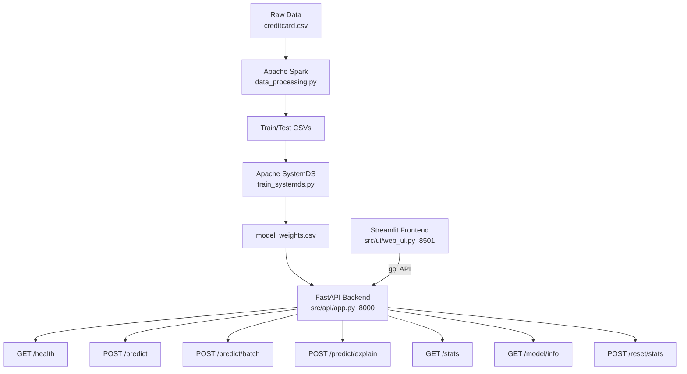

# 💳 Credit Card Fraud Detection

<p align="center">
  
  
  
  
  
  
  
</p>

<p align="center">
  Hệ thống phát hiện gian lận giao dịch thẻ tín dụng tích hợp<br>
  <b>Apache Spark</b> + <b>Apache SystemDS</b> + <b>FastAPI</b> + <b>Streamlit</b>
</p>

---

## 📋 Mục lục

- [Tổng quan](#-tổng-quan)
- [Kiến trúc hệ thống](#-kiến-trúc-hệ-thống)
- [Cấu trúc dự án](#-cấu-trúc-dự-án)
- [Yêu cầu hệ thống](#-yêu-cầu-hệ-thống)
- [Cài đặt](#-cài-đặt)
- [Chạy ứng dụng](#-chạy-ứng-dụng)
- [API Endpoints](#-api-endpoints)
- [Frontend - Streamlit Dashboard](#-frontend---streamlit-dashboard)
- [Docker Deployment](#-docker-deployment)
- [Xử lý lỗi thường gặp](#-xử-lý-lỗi-thường-gặp)

---

## 📌 Tổng quan

**Credit Card Fraud Detection** là hệ thống end-to-end phát hiện gian lận giao dịch thẻ tín dụng, từ xử lý dữ liệu lớn (Spark) → huấn luyện mô hình (SystemDS) → API (FastAPI) → Dashboard (Streamlit).

### Tính năng nâng cao (v2.0)

| Tính năng | Mô tả |
|-----------|-------|
| **Spark Preprocessing** | VectorAssembler, StandardScaler, undersampling class 0 |
| **SystemDS Training** | l2svm (L2-regularized SVM) với intercept, 200 iterations |
| **API Backend** | 7 endpoints: predict, batch, explain, stats, model info, reset |
| **Streamlit Frontend** | 5 tabs: Dashboard, Predict, Batch, Explain AI, History |
| **Explain AI** | Feature contribution analysis, top-5 features |
| **Batch Analysis** | Upload CSV (tối đa 100 transactions), download kết quả |
| **Session Tracking** | Stats phiên làm việc, uptime, auto-reset |
| **Dark Theme** | Giao diện tối chuyên nghiệp, glassmorphism, gradient |
| **Pydantic v2** | Validation, optional fields (transaction_id, merchant_category) |

### Công nghệ

| Layer | Công nghệ | File |
|-------|-----------|------|
| Data Processing | Apache Spark 3.5 | `src/data_processing.py` |
| Model Training | Apache SystemDS 3.2 | `src/train_systemds.py` |
| Backend API | FastAPI 0.111 + Uvicorn | `src/api/app.py` |
| Frontend UI | Streamlit 1.36 + Plotly | `src/ui/web_ui.py` |
| Validation | Pydantic v2 | `src/api/app.py` |

---

## 🏗 Kiến trúc hệ thống



---

## 📁 Cấu trúc dự án

```
credit-card-fraud-detection/
│
├── data/
│   ├── raw/creditcard.csv              # Dataset gốc (284,807 giao dịch)
│   └── processed/                      # Dữ liệu đã xử lý
│       ├── X_train.csv / y_train.csv   # Train (812 mẫu)
│       ├── X_test.csv / y_test.csv     # Test (156 mẫu)
│       ├── full_scaled.csv             # Full data đã scaling
│       └── model_weights.csv           # Trọng số mô hình
│
├── src/
│   ├── __init__.py
│   ├── data_processing.py              # Apache Spark preprocessing
│   ├── train_systemds.py               # Apache SystemDS training
│   │
│   ├── api/
│   │   ├── __init__.py
│   │   └── app.py                      # FastAPI backend (7 endpoints)
│   │
│   └── ui/
│       ├── __init__.py
│       └── web_ui.py                   # Streamlit dashboard (5 tabs)
│
├── docker/
│   ├── Dockerfile                      # python:3.9-slim + JDK 11
│   └── requirements.txt                # Python dependencies
│
├── .vscode/settings.json               # VS Code config
├── docker-compose.yml                  # 2 services (API + UI)
├── logo_credit-card.jpg                # Logo cho dashboard
├── run_pipeline.sh                     # Pipeline tự động
└── README.md
```

---

## ⚙️ Yêu cầu hệ thống

| Thành phần | Yêu cầu | Kiểm tra |
|-----------|---------|----------|
| Python | 3.9+ | `python --version` |
| Java | OpenJDK 11+ | `java -version` |
| JAVA_HOME | Đúng đường dẫn JDK | `echo $env:JAVA_HOME` |
| Docker | 20.10+ (tuỳ chọn) | `docker --version` |
| RAM | Tối thiểu 8GB | |

### Dataset

- **Nguồn:** [Kaggle - Credit Card Fraud Detection](https://www.kaggle.com/mlg-ulb/creditcardfraud)
- **File:** `data/raw/creditcard.csv` (~150MB, 284,807 giao dịch)
- **Tỷ lệ gian lận:** ~0.17% (492 fraud)

---

## 🚀 Cài đặt

```powershell
# 1. Clone repo
git clone <repo-url>
cd credit-card-fraud-detection

# 2. Tải dataset từ Kaggle → đặt vào data/raw/creditcard.csv

# 3. Cài dependencies
pip install -r docker/requirements.txt

# 4. (Tùy chọn) Chạy Spark preprocessing
python src/data_processing.py

# 5. (Tùy chọn) Chạy SystemDS training
python src/train_systemds.py
```

> **Ghi chú:** Bước 4-5 chỉ cần chạy **1 lần duy nhất**. Nếu đã có file `data/processed/model_weights.csv`, có thể bỏ qua.

---

## 🎮 Chạy ứng dụng

### Cách 1: Chạy thủ công (2 terminal)

```powershell
# Terminal 1 - Backend API (cổng 8000)
python -m uvicorn src.api.app:app --host 0.0.0.0 --port 8000

# Terminal 2 - Frontend UI (cổng 8501)
streamlit run src/ui/web_ui.py --server.port=8501
```

### Cách 2: Pipeline tự động (Linux/Mac)

```bash
chmod +x run_pipeline.sh
./run_pipeline.sh
```

### Cách 3: Docker Compose

```powershell
docker compose up --build -d
```

### Truy cập

| Ứng dụng | URL |
|----------|-----|
| **Dashboard Streamlit** | http://localhost:8501 |
| **API FastAPI (Swagger)** | http://localhost:8000/docs |
| **API Health Check** | http://localhost:8000/health |

---

## 🔌 API Endpoints

### `GET /` — Thông tin API

```json
{"message": "Credit Card Fraud Detection API", "version": "2.0.0", "model_loaded": true}
```

### `GET /health` — Health check

```json
{"status": "healthy", "model_loaded": true, "num_features": 30}
```

### `POST /predict` — Dự đoán 1 giao dịch

**Request:**
```json
{
  "V1": -1.36, "V2": -0.07, ..., "V28": -0.02,
  "Time": 75000.0, "Amount": 149.62,
  "transaction_id": "TX-0001",
  "merchant_category": null
}
```

**Response:**
```json
{
  "is_fraud": false,
  "fraud_probability": 0.0023,
  "risk_level": "Low",
  "transaction_id": "TX-0001",
  "timestamp": "2026-05-18T23:30:00+00:00"
}
```

### `POST /predict/batch` — Dự đoán hàng loạt

**Request:** `{"transactions": [<TransactionInput>, ...]}` (1–100 items)

**Response:**
```json
{
  "results": [...],
  "total": 20,
  "fraud_count": 3,
  "fraud_rate": 0.15,
  "processing_time_ms": 45.23
}
```

### `POST /predict/explain` — Giải thích kết quả

Trả về top-5 features có contribution lớn nhất + explanation text bằng tiếng Việt.

### `GET /stats` — Thống kê phiên

```json
{
  "total_predictions": 42,
  "fraud_detected": 5,
  "avg_probability": 0.12,
  "uptime_seconds": 3600.5,
  "high_risk_count": 2,
  "medium_risk_count": 3,
  "low_risk_count": 37
}
```

### `GET /model/info` — Thông tin model

```json
{
  "num_features": 30,
  "top_10_weights": [{"feature": "Amount_scaled", "abs_weight": 0.9014}, ...],
  "bias": -0.1022,
  "model_type": "Logistic Regression",
  "framework": "SystemDS"
}
```

### `POST /reset/stats` — Reset thống kê

```json
{"message": "Stats đã được reset", "reset_at": "2026-05-18T23:30:00+00:00"}
```

---

## 🖥️ Frontend - Streamlit Dashboard

### 5 Tabs chức năng

| Tab | Mô tả |
|-----|-------|
| **📊 Dashboard** | 4 metric cards (live từ /stats), biểu đồ Amount distribution, donut chart, timeline, heatmap correlation |
| **🔍 Kiểm tra GD** | Form nhập Amount/Time/V1-V28, 2 nút Random (Normal/Suspicious), gauge chart, alert animation |
| **📦 Batch Analysis** | Upload CSV hoặc dùng demo data, batch predict, download kết quả |
| **🧠 Explain AI** | Top 10 feature importance bar chart, explain 1 transaction cụ thể với contribution analysis |
| **📜 Lịch sử** | Timeline chart, danh sách 50 giao dịch gần nhất, download CSV |

### Sidebar

- 🔌 **Trạng thái hệ thống** — Health check, retry tự động
- 📊 **Thống kê phiên** — Tổng GD, gian lận, xác suất TB, uptime
- 🔄 **Reset Stats** — 1 click reset
- 🤖 **Thông tin Model** — Loại, framework, features, bias

### Random Transaction

| Nút | Amount | V features |
|-----|--------|------------|
| 🎲 **Random (Normal)** | $5–300 | ~N(0, 1) |
| ⚠️ **Random (Suspicious)** | $500–5000 | V3,V4,V10,V12,V14 âm lớn |

---

## 🐳 Docker Deployment

### Services

| Service | Container | Port | Command |
|---------|-----------|------|---------|
| **backend-api** | `fraud-backend` | 8000 | `uvicorn src.api.app:app` |
| **frontend-ui** | `fraud-frontend` | 8501 | `streamlit run src/ui/web_ui.py` |

### Commands

```powershell
docker compose up --build -d
docker compose logs -f backend-api
docker compose down
```

### Volume mounts

| Host | Container | Mục đích |
|------|-----------|----------|
| `./src` | `/app/src` | Live-reload |
| `./data` | `/app/data` | Dữ liệu + model |

---

## 🐛 Xử lý lỗi thường gặp

### Port already in use (WinError 10013)

```powershell
netstat -ano | findstr ":8000"
Stop-Process -Id <PID> -Force
```

### API không khả dụng trên Dashboard

Kiểm tra:
- API đang chạy: `curl http://localhost:8000/health`
- `API_URL` trong web_ui.py đúng port
- CORS: backend đã `allow_origins=["*"]`

### Pydantic validation error

Đảm bảo:
- V1-V28 trong khoảng [-20, 20]
- Amount >= 0
- Sử dụng Pydantic v2 (`pip install pydantic>=2.0`)

### Docker daemon not running

```
failed to connect to the docker API at npipe:////./pipe/dockerDesktopLinuxEngine
```

→ Bật Docker Desktop, hoặc chạy không Docker (2 terminal).

### File model_weights.csv not found

```powershell
python src/train_systemds.py
```

### Pylance import errors (VS Code)

`Ctrl+Shift+P` → `Python: Select Interpreter` → chọn Python đã pip install dependencies.

---

## 📊 Model weights thực tế

| Feature | Weight |
|---------|--------|
| Amount_scaled | -0.9014 |
| V27 | +0.5545 |
| V7 | -0.2950 |
| Time_scaled | -0.2876 |
| V3 | +0.2426 |
| V22 | -0.2401 |
| V1 | -0.2223 |
| V6 | +0.2020 |
| V2 | -0.1922 |
| V13 | -0.1798 |

**Bias:** -0.1022 | **Algorithm:** l2svm | **Train samples:** 812

---

## 🛠 Công nghệ

<p align="center">
  
  
  
  
  
  
  
  
</p>

---

<p align="center">
  <b>FraudShield v2.0</b><br>
  <i>Apache Spark • SystemDS • FastAPI • Streamlit</i>
</p>
