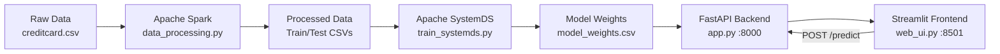

# 💳 Credit Card Fraud Detection

<p align="center">
  
  
  
  
  
  
</p>

<p align="center">
  Hệ thống phát hiện gian lận giao dịch thẻ tín dụng tích hợp<br>
  <b>Apache Spark</b> (tiền xử lý) + <b>Apache SystemDS</b> (huấn luyện) + <b>FastAPI</b> (API) + <b>Streamlit</b> (Dashboard)
</p>

---

## 📋 Mục lục

- [Tổng quan](#-tổng-quan)
- [Kiến trúc hệ thống](#-kiến-trúc-hệ-thống)
- [Cấu trúc dự án](#-cấu-trúc-dự-án)
- [Yêu cầu hệ thống](#-yêu-cầu-hệ-thống)
- [Cài đặt & Chạy](#-cài-đặt--chạy)
- [Cách sử dụng](#-cách-sử-dụng)
- [API Endpoints](#-api-endpoints)
- [Docker Deployment](#-docker-deployment)
- [Kết quả thực tế](#-kết-quả-thực-tế)
- [Xử lý lỗi thường gặp](#-xử-lý-lỗi-thường-gặp)

---

## 📌 Tổng quan

**Credit Card Fraud Detection** là hệ thống end-to-end phát hiện gian lận giao dịch thẻ tín dụng sử dụng các công nghệ Big Data và Machine Learning hiện đại:

| Công nghệ | Vai trò |
|-----------|---------|
| **Apache Spark** | Tiền xử lý dữ liệu quy mô lớn, chuẩn hóa, xử lý mất cân bằng |
| **Apache SystemDS** | Huấn luyện mô hình SVM (l2svm) với tối ưu phân tán |
| **FastAPI** | Backend API phục vụ dự đoán, CORS, Pydantic validation |
| **Streamlit** | Dashboard trực quan với biểu đồ Plotly, form dự đoán realtime |

### Tính năng chính

- ✅ **Xử lý dữ liệu lớn** với Apache Spark (VectorAssembler, StandardScaler, undersampling)
- ✅ **Huấn luyện phân tán** với Apache SystemDS (l2svm, intercept, regularization)
- ✅ **API chuyên nghiệp** với FastAPI (CORS, Pydantic v2, lifespan, health check)
- ✅ **Dashboard đẹp** với Streamlit (Plotly charts, custom CSS gradient, progress bar, st.snow/balloons)
- ✅ **Docker hóa** toàn bộ hệ thống (docker-compose 2 services)
- ✅ **Pipeline tự động** (run_pipeline.sh có màu sắc)

---

## 🏗 Kiến trúc hệ thống



**Luồng dữ liệu:**

1. **Spark** đọc CSV raw → làm sạch → scale Time/Amount (StandardScaler) → undersampling class 0 → train/test split (80/20)
2. **SystemDS** đọc train data → huấn luyện l2svm (intercept=True, reg=0.001, maxIter=200) → xuất weights + bias
3. **FastAPI** load weights → nhận request → scale Time/Amount bằng mean/std từ raw → dot product → sigmoid → `is_fraud` + `fraud_probability` + `risk_level`
4. **Streamlit** hiển thị dashboard (4 biểu đồ Plotly) + form nhập 30 features + nút Random Transaction → gọi API → progress bar + alert + hiệu ứng

---

## 📁 Cấu trúc dự án

```
credit-card-fraud-detection/
│
├── data/
│   ├── raw/                    # Dữ liệu gốc (creditcard.csv - 284,807 dòng)
│   │   └── creditcard.csv
│   └── processed/              # Dữ liệu đã xử lý
│       ├── X_train.csv         # Feature matrix Train (812 x 30)
│       ├── y_train.csv         # Labels Train (812 x 1)
│       ├── X_test.csv          # Feature matrix Test (156 x 30)
│       ├── y_test.csv          # Labels Test (156 x 1)
│       ├── full_scaled.csv     # Full data đã scale (cho dashboard)
│       └── model_weights.csv   # Trọng số mô hình (31 dòng)
│
├── src/
│   ├── __init__.py
│   ├── data_processing.py      # Apache Spark preprocessing
│   ├── train_systemds.py       # Apache SystemDS training (l2svm)
│   ├── app.py                  # FastAPI backend
│   └── web_ui.py               # Streamlit dashboard
│
├── docker/
│   ├── Dockerfile              # python:3.9-slim + OpenJDK 11
│   └── requirements.txt        # Python dependencies
│
├── .vscode/
│   └── settings.json           # VS Code config (tắt Pylance warnings)
│
├── docker-compose.yml          # 2 services: backend-api + frontend-ui
├── run_pipeline.sh             # Pipeline tự động (có màu sắc)
└── README.md                   # Bạn đang đọc nó đấy!
```

---

## ⚙️ Yêu cầu hệ thống

| Thành phần | Yêu cầu | Kiểm tra |
|-----------|---------|----------|
| **Python** | 3.9+ | `python --version` |
| **Java** | OpenJDK 11+ | `java -version` |
| **JAVA_HOME** | Set đúng đường dẫn JDK | `echo $env:JAVA_HOME` |
| **Docker** | 20.10+ (tùy chọn) | `docker --version` |
| **RAM** | Tối thiểu 8GB (16GB cho Spark) | |
| **Disk** | ~3GB (dataset + dependencies + model) | |

### Dataset

- **Nguồn:** [Kaggle - Credit Card Fraud Detection](https://www.kaggle.com/mlg-ulb/creditcardfraud)
- **File:** `creditcard.csv` (~150MB)
- **Đặt tại:** `data/raw/creditcard.csv`
- **Cấu trúc:** 284,807 giao dịch, 31 cột (V1-V28, Time, Amount, Class)
- **Tỷ lệ gian lận:** ~0.17% (492 giao dịch gian lận)

---

## 🚀 Cài đặt & Chạy

### Cách 1: Chạy thủ công từng bước (Khuyến nghị cho Windows)

```powershell
# Bước 1: Cài đặt dependencies
pip install -r docker/requirements.txt

# Bước 2: Xử lý dữ liệu với Spark (~30 giây)
python src/data_processing.py

# Bước 3: Huấn luyện mô hình với SystemDS (~5 giây)
python src/train_systemds.py

# Bước 4a: Terminal 1 - Backend API
python -m uvicorn src.app:app --host 0.0.0.0 --port 8000

# Bước 4b: Terminal 2 - Frontend Dashboard
streamlit run src/web_ui.py --server.port=8501
```

### Cách 2: Pipeline tự động (Linux/Mac)

```bash
chmod +x run_pipeline.sh
./run_pipeline.sh
```

### Cách 3: Docker Compose

```bash
# Build và chạy
docker compose up --build -d

# Xem logs
docker compose logs -f

# Dừng
docker compose down
```

### Sau khi chạy

| Ứng dụng | URL |
|----------|-----|
| **Dashboard Streamlit** | http://localhost:8501 |
| **API FastAPI** | http://localhost:8000 |
| **API Docs (Swagger)** | http://localhost:8000/docs |
| **Health Check** | http://localhost:8000/health |

---

## 🎯 Cách sử dụng

### 1. Dashboard Tổng quan

Mở `http://localhost:8501` → tab **Dashboard**:

- 📊 **Biểu đồ phân phối số tiền** (histogram, phân biệt legit/fraud)
- 📊 **So sánh giao dịch an toàn vs gian lận** (bar chart)
- 📊 **Phân phối thời gian giao dịch** (histogram)
- 📊 **Tỷ lệ phát hiện gian lận** (donut chart)
- 📈 **4 metric cards**: tổng giao dịch, an toàn, gian lận, tỷ lệ rủi ro

### 2. Kiểm tra Giao dịch

Tab **Kiểm tra Giao dịch**:

1. **Nhập thủ công:** Amount, Time + 28 V features (7 hàng x 4 cột)
2. **🎲 Random Transaction:** Sinh dữ liệu ngẫu nhiên (90% legit, 10% fraud)
3. **🚀 Kiểm tra:** Gọi API → progress bar + alert màu + hiệu ứng (snow/balloons)

### 3. API Docs

Mở `http://localhost:8000/docs` → Swagger UI, test API trực tiếp.

---

## 🔌 API Endpoints

### `GET /`

```json
{"message": "Credit Card Fraud Detection API", "status": "running", "model_loaded": true, "version": "1.0.0"}
```

### `GET /health`

```json
{"status": "healthy", "model_loaded": true, "num_features": 30}
```

### `POST /predict`

**Request:**
```json
{
  "V1": -1.36, "V2": -0.07, "V3": 0.0, ..., "V28": -0.02,
  "Time": 75000.0, "Amount": 149.62
}
```

**Response:**
```json
{
  "is_fraud": false,
  "fraud_probability": 0.0023,
  "risk_level": "Low"
}
```

Cơ chế dự đoán:
1. Time, Amount được chuẩn hóa (z-score) bằng mean/std từ raw data
2. Feature vector [V1..V28, Time_scaled, Amount_scaled] (30 chiều)
3. `logit = dot(weights, features) + bias`
4. `probability = sigmoid(logit)` | Risk: `< 0.3` Low, `0.3-0.7` Medium, `> 0.7` High

---

## 🐳 Docker Deployment

### Service Architecture

| Service | Container | Port | Command |
|---------|-----------|------|---------|
| **backend-api** | `fraud-backend` | `8000` | `uvicorn src.app:app` |
| **frontend-ui** | `fraud-frontend` | `8501` | `streamlit run src/web_ui.py` |

### Volume Mounts

| Host | Container | Mục đích |
|------|-----------|----------|
| `./src` | `/app/src` | Live-reload |
| `./data` | `/app/data` | Dữ liệu + model |

### Docker Commands

```bash
docker compose up --build -d
docker compose logs -f backend-api
docker compose down
```

---

## 📊 Kết quả thực tế

### Xử lý dữ liệu (Spark)

| Chỉ số | Giá trị |
|--------|---------|
| Tổng giao dịch | 284,807 |
| Giao dịch hợp lệ | 284,315 |
| Giao dịch gian lận | 492 (0.17%) |
| Sau undersampling | 968 (476 legit + 492 fraud) |
| Train | 812 mẫu |
| Test | 156 mẫu |
| Features | 30 (V1-V28 + Time_scaled + Amount_scaled) |

### Huấn luyện (SystemDS)

| Tham số | Giá trị |
|---------|---------|
| Thuật toán | l2svm (L2-regularized SVM) |
| Số vòng lặp | 200 |
| epsilon | 1e-7 |
| reg | 0.001 |
| intercept | True |
| Bias | -0.1022 |

**Top 5 features quan trọng nhất:**

| Feature | Weight |
|---------|--------|
| Amount_scaled | -0.9014 |
| V27 | +0.5545 |
| V7 | -0.2950 |
| Time_scaled | -0.2876 |
| V3 | +0.2426 |

### API Performance (local test)

| Endpoint | Response time |
|----------|--------------|
| `GET /health` | < 10ms |
| `POST /predict` | < 50ms |

---

## 🐛 Xử lý lỗi thường gặp

### 1. Port already in use (WinError 10013)

```powershell
# Tìm process chiếm port
netstat -ano | findstr ":8000"

# Kill process (thay PID bằng số từ cột bên phải)
Stop-Process -Id <PID> -Force
```

### 2. Pylance import errors trong VS Code

Tạo file `.vscode/settings.json` (đã có sẵn):

```json
{"python.defaultInterpreterPath": "python", "python.analysis.typeCheckingMode": "off"}
```

Hoặc `Ctrl+Shift+P` → `Python: Select Interpreter` → chọn Python đã `pip install`.

### 3. Docker daemon not running

```
failed to connect to the docker API at npipe:////./pipe/dockerDesktopLinuxEngine
```

→ Khởi động Docker Desktop hoặc chạy **Cách 1** (không cần Docker).

### 4. Spark/SystemDS lỗi (Java not found)

Đảm bảo:
- Java 11+ installed: `java -version`
- `JAVA_HOME` set: `$env:JAVA_HOME` (hoặc `echo $JAVA_HOME`)

---

## 🛠 Công nghệ sử dụng

<p align="center">
  
  
  
  
  
  
  
  
</p>

---

## 📄 License

MIT License

---

<p align="center">
  <b>Made with ❤️ by Data Science Team</b><br>
  <i>Apache Spark • Apache SystemDS • FastAPI • Streamlit</i>
</p>
